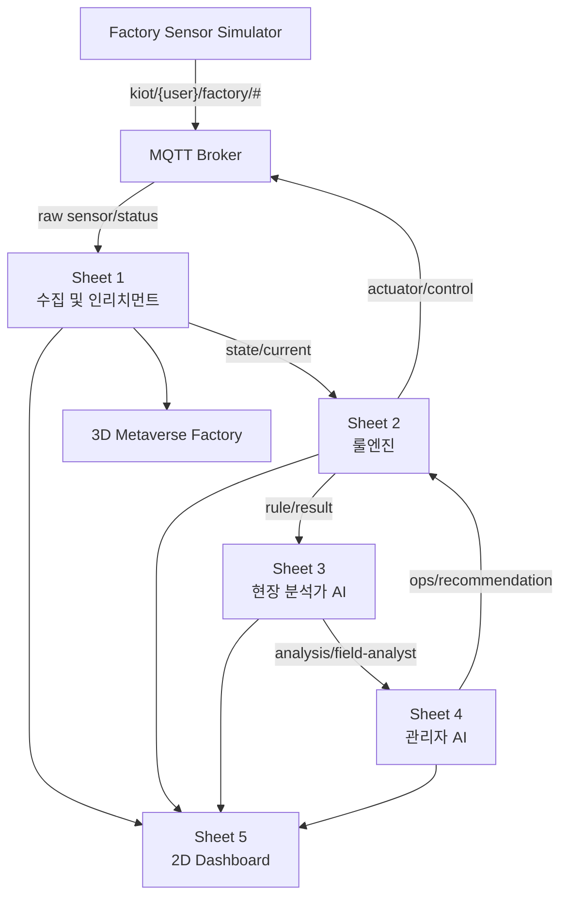

# 전체 시스템 개요

## 시스템 구성

이 프로젝트는 크게 네 계층으로 구성됩니다.

1. 공장 환경 시뮬레이터
2. MQTT 메시지 브로커
3. Node-RED 디지털 트윈 서버
4. 2D/3D 시각화 및 AI 운영지원

## 데이터 흐름

## 책임 분리

- 공장 환경 시뮬레이터
  - 온도, 진동, 컨베이어벨트, 에어컨 상태 계산
  - `factory` raw 센서/status 발행
  - actuator control 토픽 구독

- Node-RED 디지털 트윈 서버
  - 시트 1: 수집 및 인리치먼트
  - 시트 2: 룰엔진 기반 최종 제어
  - 시트 3: 현장 분석가 AI
  - 시트 4: 관리자 AI와 운영 권고
  - 시트 5: 2D Dashboard

- 시각화 계층
  - 현재 상태 표시
  - 룰엔진 판단 표시
  - 운영 권고 표시
  - 3D 공간 기반 이해 확장

## 핵심 설계 원칙

- 실세계 토픽과 디지털 트윈 토픽을 분리합니다.
- 룰엔진이 최종 제어권을 갖습니다.
- AI 에이전트는 직접 제어하지 않고 해석과 권고를 담당합니다.
- API Key와 개인 정보는 공개 문서와 JSON에 포함하지 않습니다.

## 다음 문서

- [디지털 트윈 팩토리 실습 핸드북](/handbook/)
- [설비환경시뮬레이터](/architecture/simulator)
- [엣지제어운영서버](/architecture/edge-server)
