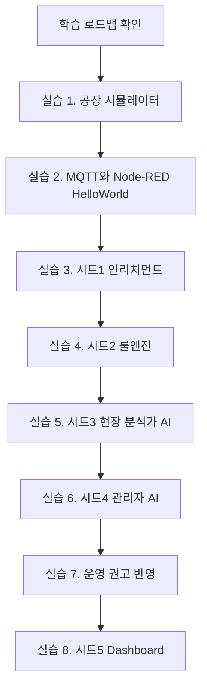

# 00. 학습 로드맵

## 이 단계에서 배우는 것

전체 실습이 어떤 순서로 연결되는지 먼저 파악합니다. 이 실습은 특정 도구 하나를 익히는 과정이 아니라, 공장 데이터가 디지털 트윈으로 들어와 판단, 권고, 제어, 시각화로 이어지는 전체 흐름을 구현하는 과정입니다.

## 전체 흐름에서의 위치



## 1시간 단위 운영안

| 시간 | 단계 | 주제 | 완료 기준 |
| --- | --- | --- | --- |
| 1시간차 | 실습 1 | 공장 환경 시뮬레이터 | MQTTX에서 raw 센서/status 확인 |
| 2시간차 | 실습 2 | Node-RED 기초와 시트1 | HelloWorld 후 `state/current` 확인 |
| 3시간차 | 실습 3 | 시트1 인리치먼트 | `dt/factory`, `state/current` 생성 |
| 4시간차 | 실습 4 | 시트2 룰엔진 | 35도 에어컨, 45도 셧다운 기준 확인 |
| 5시간차 | 실습 5 | 시트3 현장 분석가 AI | mock 또는 LLM 의견 발행 확인 |
| 6시간차 | 실습 6 | 시트4 관리자 AI | `ops/recommendation` 생성 |
| 7시간차 | 실습 7 | 운영 권고 반영 | 권고를 룰엔진이 안전하게 반영 |
| 8시간차 | 실습 8 | 시트5 Dashboard | 전체 상태와 판단 흐름 관제 |

## 실습 운영 방식

각 단계는 다음 순서로 진행합니다.

1. 역할을 먼저 이해합니다.
2. 필요한 토픽을 확인합니다.
3. Node-RED 시트를 import합니다.
4. MQTTX로 입출력 메시지를 확인합니다.
5. 성공 기준을 만족하면 다음 단계로 넘어갑니다.

## 공통 준비물

- Node.js
- Node-RED
- MQTTX
- 브라우저
- 공장 시뮬레이터 저장소
- Node-RED 시트 JSON
- 선택 사항: Gemini API Key, OpenAI API Key, Claude API Key, 로컬 Ollama

## 공통 브로커

```text
broker.emqx.io:1883
```

강사가 원격으로 학생들의 실습 토픽을 점검할 수 있도록 공용 MQTT 브로커를 사용합니다.

## 성공 기준

- 각 단계에서 어떤 토픽이 입력이고 출력인지 설명할 수 있습니다.
- `factory`와 `dt/factory`의 차이를 설명할 수 있습니다.
- 룰엔진과 AI 에이전트의 역할 차이를 설명할 수 있습니다.
- Dashboard가 운영 관제에서 어떤 역할을 하는지 설명할 수 있습니다.

## 다음 단계로 넘어가기 전 체크

- 자신의 `uniq-user-id`를 정했습니다.
- MQTTX에서 `kiot/{내-user-id}/#` 구독 방법을 알고 있습니다.
- Node-RED에서 변경 후 `배포하기`를 눌러야 한다는 점을 알고 있습니다.
