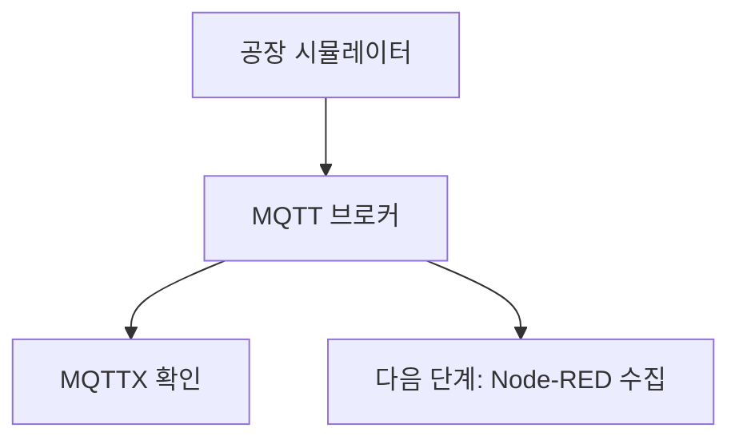

# 01. 공장 시뮬레이터

## 이 단계에서 배우는 것

실제 공장 센서와 설비를 대신하는 공장 시뮬레이터를 실행하고, MQTTX로 raw 센서 데이터와 액추에이터 상태가 정상 발행되는지 확인합니다.

## 전체 흐름에서의 위치



## 준비물

- 공장 시뮬레이터 저장소
- Node.js 실행 환경
- MQTTX
- 자신의 `uniq-user-id`

## 실습 저장소

공장 시뮬레이터는 별도 GitHub 저장소에서 관리합니다.

- 저장소: [facility-environment-simulator](https://github.com/zenit9hub/facility-environment-simulator)
- 먼저 저장소의 `README.md`를 읽고 실행 준비, 환경변수, 실행 명령, 테스트 명령을 확인합니다.
- 핵심 실행 변수는 `MQTT_UNIQ_USER_ID`입니다.
- 핸드북에서는 해당 저장소를 실행한 뒤 MQTTX와 Node-RED로 연결하는 실습 흐름을 다룹니다.
- 세부 실행 옵션과 테스트 명령은 저장소의 `README.md`를 기준으로 확인합니다.

```bash
git clone https://github.com/zenit9hub/facility-environment-simulator.git
cd facility-environment-simulator
npm install
```

## 시뮬레이터 역할

시뮬레이터는 작은 공장 룸을 흉내 냅니다.

- 온도 센서 값을 발행합니다.
- 진동 센서 값을 발행합니다.
- 컨베이어벨트 상태를 발행합니다.
- 에어컨 상태를 발행합니다.
- 컨베이어벨트와 에어컨 제어 메시지를 수신합니다.
- 제어 메시지를 받으면 상태를 즉시 반영해 status를 추가 발행합니다.

## 발행 토픽

```text
kiot/{uniq-user-id}/factory/room-01/sensor/temperature
kiot/{uniq-user-id}/factory/room-01/sensor/vibration
kiot/{uniq-user-id}/factory/room-01/actuator/conveyor-belt/status
kiot/{uniq-user-id}/factory/room-01/actuator/aircon/status
```

## 구독 토픽

```text
kiot/{uniq-user-id}/factory/room-01/actuator/conveyor-belt/control
kiot/{uniq-user-id}/factory/room-01/actuator/aircon/control
```

## 따라하기

1. 시뮬레이터 저장소를 clone하고 `README.md`를 확인합니다.
2. `.env` 또는 실행 환경에서 `MQTT_UNIQ_USER_ID`를 자신의 ID로 설정합니다.
3. MQTT 브로커가 `mqtt://broker.emqx.io:1883`인지 확인합니다.
4. 시뮬레이터를 실행합니다.
5. 로컬 제어 패널이 제공되면 `http://localhost:3000`을 엽니다.
6. MQTTX에서 `kiot/{내-user-id}/factory/#`을 구독합니다.
7. 센서와 status 메시지가 10초 주기로 보이는지 확인합니다.

## 제어 메시지 예시

컨베이어벨트 켜기:

```text
kiot/{uniq-user-id}/factory/room-01/actuator/conveyor-belt/control
```

```json
{
  "power": "on",
  "overheatMode": "off",
  "reason": "manual-test"
}
```

컨베이어벨트 과열 모드 켜기:

```json
{
  "power": "on",
  "overheatMode": "on",
  "reason": "overheat-test"
}
```

에어컨 켜기:

```text
kiot/{uniq-user-id}/factory/room-01/actuator/aircon/control
```

```json
{
  "power": "on",
  "reason": "manual-test"
}
```

## 온도 모델

| 조건 | 변화 |
| --- | --- |
| 두 장비 모두 꺼짐 | 평상 온도 25도로 0.1도씩 복귀 |
| 에어컨만 켜짐 | 최저 22도까지 냉각 |
| 컨베이어벨트만 켜짐 | 최대 50도까지 가열 |
| 컨베이어벨트 가동 | +0.2도 |
| 에어컨 가동 | -0.3도 |
| 둘 다 가동 | 에어컨 성능 우세로 -0.1도 |
| 과열 모드 켜짐 | 컨베이어벨트 가동 중 추가 +1.0도 |

`overheatMode`는 상태값입니다. 컨베이어벨트가 꺼져 있으면 온도 상승에 관여하지 않습니다.

## 성공 기준

- MQTTX에서 4개 raw 토픽이 보입니다.
- control 메시지를 보내면 status가 즉시 바뀝니다.
- 과열 모드로 온도 상승 테스트를 만들 수 있습니다.

## 자주 막히는 지점

- 메시지가 안 보이면 사용자 ID와 구독 토픽을 먼저 확인합니다.
- 브로커가 `localhost`면 강사가 원격 점검할 수 없습니다.
- control 토픽에 `dt`를 넣으면 시뮬레이터가 받지 못합니다.

## 다음 단계로 넘어가기 전 체크

- `factory` 토픽이 실세계 raw 데이터 영역이라는 점을 설명할 수 있습니다.
- 시뮬레이터가 위험 판단을 하지 않는다는 점을 이해했습니다.
- MQTTX로 status 변화까지 확인했습니다.
