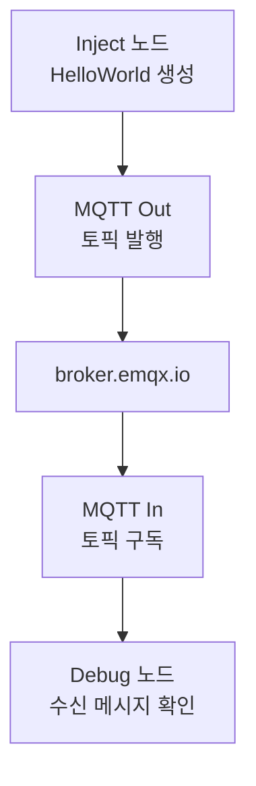

# 02. MQTT와 Node-RED HelloWorld

## 이 단계에서 배우는 것

Node-RED를 처음 실행한 뒤 MQTT 메시지를 발행하고 구독하는 가장 작은 샘플을 구성합니다. 이후 시트1~5를 import하기 전에 MQTT 노드 동작 방식을 먼저 확인하는 단계입니다.

## 전체 흐름에서의 위치



## 준비물

- Node-RED 실행 환경
- MQTTX
- 브로커 주소: `broker.emqx.io`
- 포트: `1883`
- 자신의 `uniq-user-id`

## 권장 토픽

```text
kiot/{uniq-user-id}/hello/world
```

예시:

```text
kiot/student-01/hello/world
```

## 따라하기

1. Node-RED를 실행합니다.
2. 새 flow에 `inject` 노드를 추가합니다.
3. payload를 문자열 `hello digital twin`으로 설정합니다.
4. `mqtt out` 노드를 추가합니다.
5. 브로커를 `broker.emqx.io`, 포트를 `1883`으로 설정합니다.
6. topic을 `kiot/{내-user-id}/hello/world`로 설정합니다.
7. `mqtt in` 노드를 추가하고 같은 topic을 구독합니다.
8. `debug` 노드에 연결합니다.
9. `배포하기`를 누릅니다.
10. inject 버튼을 눌러 debug 창에 메시지가 보이는지 확인합니다.

## MQTTX 확인

MQTTX에서도 같은 토픽을 구독합니다.

```text
kiot/{uniq-user-id}/hello/world
```

Node-RED에서 inject 버튼을 눌렀을 때 MQTTX에도 메시지가 보이면 성공입니다.

## 성공 기준

- Node-RED에서 MQTT 브로커 연결이 성공합니다.
- `mqtt out`으로 발행한 메시지를 `mqtt in`과 MQTTX에서 모두 확인합니다.
- topic 오타가 있으면 메시지가 연결되지 않는다는 점을 이해합니다.

## 자주 막히는 지점

- 브로커 이름을 `emqx` 같은 표시명으로만 보고 실제 서버 주소를 빠뜨리는 경우가 있습니다.
- `배포하기`를 누르지 않으면 변경사항이 적용되지 않습니다.
- 여러 학생이 같은 client id를 쓰면 연결이 끊길 수 있습니다. client id는 비워두거나 자동 생성되게 두는 편이 안전합니다.

## 다음 단계로 넘어가기 전 체크

- `mqtt in`은 구독, `mqtt out`은 발행이라는 차이를 설명할 수 있습니다.
- topic이 메시지의 목적지를 결정한다는 점을 이해했습니다.
- Node-RED에서 브로커 설정과 토픽 설정이 분리된다는 점을 확인했습니다.
