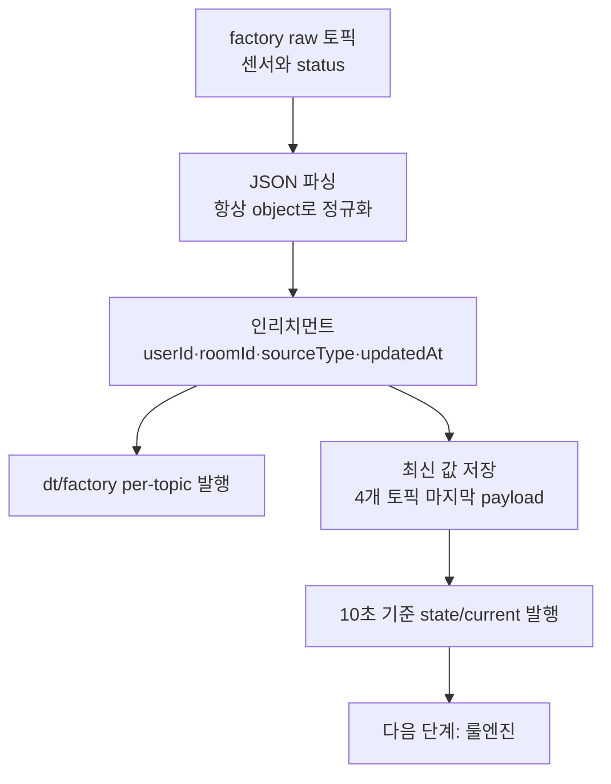

# 03. 시트1 인리치먼트

## 이 단계에서 배우는 것

공장 시뮬레이터의 raw 토픽을 Node-RED에서 수집하고, 디지털 트윈 서버가 판단하기 좋은 형태로 인리치먼트합니다.

시트1의 핵심 결과는 두 가지입니다.

- 개별 `dt/factory` 토픽 발행
- 최신 상태 스냅샷 `state/current` 발행

## 전체 흐름에서의 위치



## 준비물

- 공장 시뮬레이터 실행
- Node-RED
- 시트1 JSON
- MQTTX

## 입력 토픽

```text
kiot/{uniq-user-id}/factory/room-01/sensor/temperature
kiot/{uniq-user-id}/factory/room-01/sensor/vibration
kiot/{uniq-user-id}/factory/room-01/actuator/conveyor-belt/status
kiot/{uniq-user-id}/factory/room-01/actuator/aircon/status
```

## 출력 토픽

```text
kiot/{uniq-user-id}/dt/factory/room-01/sensor/temperature
kiot/{uniq-user-id}/dt/factory/room-01/sensor/vibration
kiot/{uniq-user-id}/dt/factory/room-01/actuator/conveyor-belt/status
kiot/{uniq-user-id}/dt/factory/room-01/actuator/aircon/status
kiot/{uniq-user-id}/dt/factory/room-01/state/current
```

## 인리치먼트로 얻는 것

raw 메시지는 단일 센서값 또는 단일 상태값입니다. 룰엔진이 매번 여러 토픽을 직접 조합하면 판단 로직이 복잡해집니다.

시트1은 각 토픽의 마지막 값을 저장하고, 일정 주기마다 최신 값을 묶어 `state/current`를 발행합니다. 이렇게 하면 룰엔진은 항상 같은 구조의 상태 스냅샷을 받아 판단할 수 있습니다.

## `state/current` 핵심 필드

```json
{
  "snapshotMode": "fixed-interval-latest",
  "completeness": "ready",
  "sensors": {
    "temperature": {
      "value": 25,
      "updatedAt": "2026-04-19T00:00:00.000Z"
    },
    "vibration": {
      "value": 0,
      "updatedAt": "2026-04-19T00:00:00.000Z"
    }
  },
  "actuators": {
    "conveyorBelt": {
      "power": "off",
      "overheatMode": "off",
      "updatedAt": "2026-04-19T00:00:00.000Z"
    },
    "aircon": {
      "power": "off",
      "updatedAt": "2026-04-19T00:00:00.000Z"
    }
  }
}
```

## 따라하기

1. 시트1 JSON을 Node-RED에 import합니다.
2. 토픽 안의 `zenit` 또는 예시 사용자 ID를 자신의 ID로 바꿉니다.
3. 브로커가 `broker.emqx.io:1883`인지 확인합니다.
4. `배포하기`를 누릅니다.
5. MQTTX에서 `kiot/{내-user-id}/dt/factory/#`을 구독합니다.
6. per-topic 토픽과 `state/current`가 발행되는지 확인합니다.

## 성공 기준

- raw `factory` 토픽과 enriched `dt/factory` 토픽을 구분할 수 있습니다.
- `state/current`에 온도, 진동, 컨베이어벨트, 에어컨 상태가 함께 들어 있습니다.
- 각 항목에 `updatedAt`이 있어 값의 신선도를 판단할 수 있습니다.

## 자주 막히는 지점

- `+` 와일드카드로 모든 학생 토픽을 받으면 메시지가 많고 혼동됩니다. 실습에서는 자신의 ID를 명시하는 편이 좋습니다.
- 시뮬레이터가 꺼졌는데 `state/current`가 계속 반복 발행되면 오래된 값으로 불필요한 루프를 만드는 구조입니다.
- 문자열 JSON이 그대로 들어오면 Function 노드에서 object로 파싱해야 합니다.

## 다음 단계로 넘어가기 전 체크

- `state/current`가 왜 필요한지 설명할 수 있습니다.
- 룰엔진이 개별 센서 토픽보다 스냅샷을 선호하는 이유를 이해했습니다.
- 시트1은 위험 판단이 아니라 데이터 정리 역할이라는 점을 구분할 수 있습니다.
