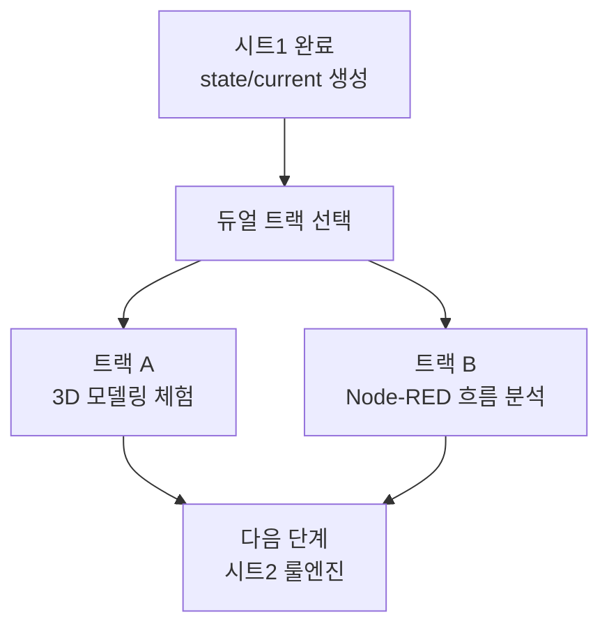

# 04. 듀얼 트랙 리뷰

## 이 단계에서 배우는 것

이 단계는 선택형 보강 구간입니다. 3D 시각화에 관심이 크면 3D 모델링 체험을 진행하고, Node-RED 구현 이해가 더 필요하면 시트1 코드 분석과 시트2 미리보기를 진행합니다.

## 전체 흐름에서의 위치

## 트랙 A. 3D 모델링 체험

### 목적

공장 공간, 컨베이어벨트, 에어컨 같은 오브젝트를 3D로 배치하면서 3D 메타버스 시각화가 어떤 장점을 갖는지 이해합니다.

### 따라하기

1. Unity 또는 Electron 기반 3D 예제를 엽니다.
2. 공장 룸, 컨베이어벨트, 에어컨 오브젝트를 확인합니다.
3. 온도 상승, 에어컨 가동, 컨베이어 정지 상태가 3D 화면에서 어떻게 표현될 수 있을지 정리합니다.
4. 2D Dashboard와 비교해 3D가 더 잘 설명하는 지점을 메모합니다.

### 성공 기준

- 3D 화면이 공간 이해에 유리한 이유를 설명할 수 있습니다.
- 3D 구현은 ROI와 제작 비용을 함께 고려해야 한다는 점을 이해합니다.

## 트랙 B. Node-RED 흐름 분석

### 목적

시트1의 데이터 처리 흐름을 분석하고, 시트2 룰엔진이 어떤 입력을 받아 어떤 출력을 만들지 예측합니다.

### 따라하기

1. 시트1의 JSON 파싱 Function 노드를 엽니다.
2. 사용자 ID와 roomId를 어디서 추출하는지 확인합니다.
3. `sourceType`, `originalTopic`, `updatedAt`이 왜 필요한지 확인합니다.
4. 최신 4개 토픽 값을 어떻게 저장하는지 확인합니다.
5. 시트2 JSON을 import하기 전에 입력과 출력 토픽만 먼저 읽어봅니다.

### 성공 기준

- 시트1이 단순 전달 노드가 아니라 데이터 전처리 구간이라는 점을 이해합니다.
- 시트2가 `state/current`를 읽어 판단한다는 점을 예측할 수 있습니다.

## 강의 운영 추천

시간이 부족하면 트랙 B를 우선합니다. 시트2 룰엔진 이해에 직접 연결되기 때문입니다. 3D 트랙은 이후 시각화 단계에서 다시 다뤄도 됩니다.

## 다음 단계로 넘어가기 전 체크

- 2D와 3D 시각화의 장단점을 말할 수 있습니다.
- 시트1의 출력이 시트2의 입력이 된다는 점을 이해했습니다.
- `state/current` 없이 개별 센서 토픽만 쓰면 룰엔진이 복잡해진다는 점을 설명할 수 있습니다.
