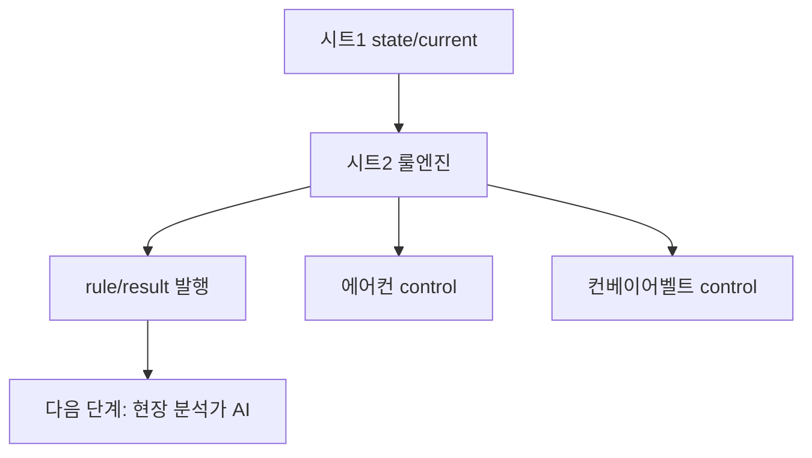

# 04. 시트2 룰엔진

## 이 단계에서 배우는 것

시트2 룰엔진은 `state/current`를 읽고, 주입된 규칙에 따라 에어컨 가동과 컨베이어벨트 셧다운을 판단합니다. 이 실습에서 룰엔진은 최종 제어권을 갖는 안전 게이트입니다.

## 전체 흐름에서의 위치



## 입력 토픽

```text
kiot/{uniq-user-id}/dt/factory/room-01/state/current
kiot/{uniq-user-id}/dt/factory/room-01/ops/recommendation
```

처음에는 `state/current`만으로 동작을 확인합니다. `ops/recommendation`은 시트4 이후 단계에서 연결합니다.

## 출력 토픽

```text
kiot/{uniq-user-id}/dt/factory/room-01/rule/result
kiot/{uniq-user-id}/factory/room-01/actuator/aircon/control
kiot/{uniq-user-id}/factory/room-01/actuator/conveyor-belt/control
```

제어 토픽은 `dt`가 아닌 실제 `factory` 영역으로 발행합니다. 룰엔진이 실제 공장 설비를 제어하는 경로이기 때문입니다.

## 기본 룰 기준

| 조건 | 판단 | 액션 |
| --- | --- | --- |
| 온도 35도 미만 | normal | 관찰 |
| 온도 35도 이상 | warning | 에어컨 on |
| 온도 45도 이상 | critical | 조건 지속 시 컨베이어벨트 off |
| 데이터 stale | hold | 제어 보류 |

강의 흐름에서는 시트2가 너무 빠르게 개입하지 않도록 룰엔진을 다소 둔하게 설정합니다. 그래야 시트3과 시트4의 AI 에이전트가 조기 경고와 선제 권고를 수행할 학습 공간이 생깁니다.

## 룰엔진이 최종 제어권을 갖는 이유

AI 에이전트는 설득력 있는 설명과 권고를 줄 수 있지만, 항상 동일한 답을 보장하지는 않습니다. 따라서 실제 제어는 룰엔진이 담당해야 합니다.

- 룰엔진: 검증된 기준으로 제어
- AI 에이전트: 상황 해석과 운영 권고
- 운영자: Dashboard에서 전체 흐름 확인

## 따라하기

1. 시트2 JSON을 Node-RED에 import합니다.
2. 사용자 ID가 시트1과 같은지 확인합니다.
3. `배포하기`를 누릅니다.
4. MQTTX에서 `kiot/{내-user-id}/dt/factory/room-01/rule/result`를 구독합니다.
5. 시뮬레이터에서 컨베이어벨트를 켭니다.
6. 과열 모드를 켜고 온도 상승을 확인합니다.
7. 35도 이상에서 에어컨 control이 발행되는지 확인합니다.
8. 45도 부근에서 critical 판단과 셧다운 조건을 확인합니다.

## 확인할 메시지

에어컨 제어:

```json
{
  "power": "on",
  "reason": "rule-warning"
}
```

컨베이어벨트 셧다운:

```json
{
  "power": "off",
  "reason": "rule-critical"
}
```

## 성공 기준

- `state/current` 수신 시 `rule/result`가 발행됩니다.
- 35도 이상에서 에어컨 control이 발행됩니다.
- 45도 이상 또는 조건 지속 시 컨베이어벨트 셧다운 흐름을 확인합니다.
- stale 데이터에서는 제어를 보류한다는 점을 이해합니다.

## 자주 막히는 지점

- 에어컨 control 토픽에 `dt`가 들어가면 시뮬레이터가 받지 못합니다.
- 시트1이 꺼져 있거나 `state/current`가 stale이면 룰엔진이 제어하지 않을 수 있습니다.
- MQTTX에서 동일 메시지가 2번 보이는 경우, 무료 브로커와 QoS 특성 또는 구독 클라이언트 상태를 함께 봐야 합니다.

## 다음 단계로 넘어가기 전 체크

- 룰엔진이 최종 제어권을 갖는 이유를 설명할 수 있습니다.
- AI가 직접 제어하지 않는 이유를 이해했습니다.
- `rule/result`가 시트3의 주요 입력이 된다는 점을 확인했습니다.
