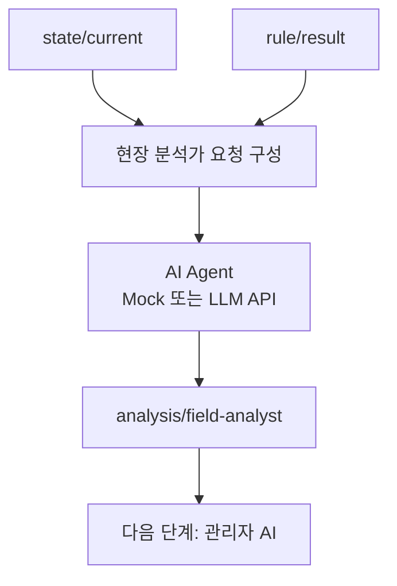

# 06. 시트3 현장 분석가 AI

## 이 단계에서 배우는 것

시트3은 룰엔진 결과와 최신 상태를 읽고, `현장 위험 조기 해석 담당자` 페르소나로 현장 의견을 생성합니다.

처음에는 mock 기반으로 동작을 확인하고, 이후 Gemini API, ChatGPT API, Claude API, 로컬 Ollama 같은 LLM으로 교체할 수 있습니다.

## 전체 흐름에서의 위치



## 입력 토픽

```text
kiot/{uniq-user-id}/dt/factory/room-01/state/current
kiot/{uniq-user-id}/dt/factory/room-01/rule/result
```

## 출력 토픽

```text
kiot/{uniq-user-id}/dt/factory/room-01/analysis/field-analyst
```

## 페르소나 역할

현장 분석가 AI는 다음 관점으로 응답합니다.

- 현재 온도와 진동 상태 해석
- 컨베이어벨트 가동 여부 확인
- 과열 모드 여부 확인
- 룰엔진 판단 결과 해석
- 35도 이전의 빠른 온도 상승 경고
- 40도 부근의 장비 보호 목적 사전 셧다운 필요성 설명

## 출력 형식

시트3의 출력은 반드시 엄격한 JSON일 필요는 없습니다. 다음 입력이 시트4 AI 에이전트이기 때문에, 현장 전문가 의견 메시지가 핵심입니다.

권장 payload:

```json
{
  "userId": "student-01",
  "roomId": "room-01",
  "generatedAt": "2026-04-19T00:00:00.000Z",
  "analystPersona": "field-risk-early-analyst",
  "llmProvider": "mock",
  "message": "온도 상승 속도가 빠릅니다. 35도 도달 전이라도 냉각 준비가 필요합니다."
}
```

## Mock을 먼저 쓰는 이유

Mock은 실제 LLM이 아니므로 해석 능력은 제한적입니다. 하지만 실습 초반에는 큰 가치가 있습니다.

- API Key 없이 전체 토픽 흐름을 검증할 수 있습니다.
- 시트4와 Dashboard 연계를 먼저 테스트할 수 있습니다.
- LLM API 호출 실패와 Node-RED 흐름 오류를 분리해서 볼 수 있습니다.

## 실제 LLM 연동 시 유의사항

- API Key를 Node-RED JSON에 직접 넣지 않습니다.
- 로컬 환경변수 또는 Node-RED credential 설정을 사용합니다.
- LLM 제공자가 바뀌어도 같은 페르소나와 같은 입력 정보를 유지합니다.
- 응답이 장황하면 시트4에서 운영 권고로 바꾸기 어려워질 수 있습니다.

## 따라하기

1. 시트3 JSON을 import합니다.
2. 먼저 `AI Agent (Mock)` 노드로 연결된 상태를 확인합니다.
3. `analysis/field-analyst` 토픽을 MQTTX에서 구독합니다.
4. 정상 상태, 과열 모드, warning 상태를 각각 만들어 메시지를 비교합니다.
5. 이후 선택적으로 Gemini API 또는 로컬 LLM 호출 노드로 교체합니다.

## 성공 기준

- `state/current`와 `rule/result` 입력을 바탕으로 현장 의견이 발행됩니다.
- 정상 상태에서는 불필요한 과잉 권고를 하지 않습니다.
- 과열 모드와 빠른 온도 상승 상황에서는 조기 경고를 생성합니다.

## 자주 막히는 지점

- 시트3과 시트4가 서로 토픽을 다시 자극하면 루프가 생길 수 있습니다.
- 정상 상태에서도 매번 강한 권고를 내면 시트4가 잘못된 운영 권고를 만들 수 있습니다.
- 실제 LLM 응답이 JSON처럼 보이더라도 시트3에서는 메시지 중심으로 취급하는 편이 안전합니다.

## 다음 단계로 넘어가기 전 체크

- 시트3이 직접 제어하지 않는다는 점을 설명할 수 있습니다.
- mock과 실제 LLM의 역할 차이를 이해했습니다.
- 현장 분석가 메시지가 시트4의 입력이 된다는 점을 확인했습니다.
