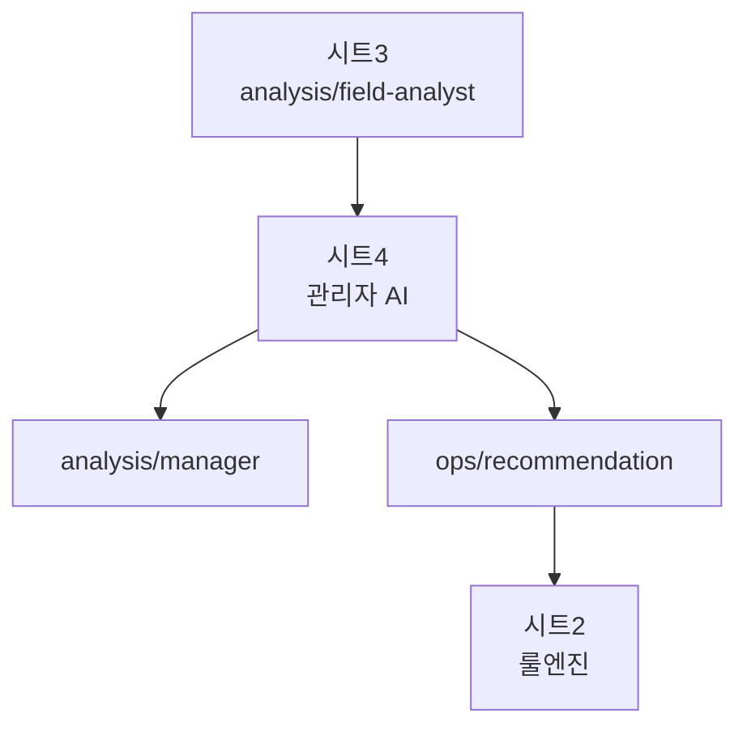

# 06. 시트4 관리자 AI

## 이 단계에서 배우는 것

시트4는 현장 분석가의 의견을 받아 운영 관점의 판단을 수행합니다. 관리자 AI는 직접 제어하지 않고, 룰엔진이 참고할 수 있는 운영 권고 메시지를 발행합니다.

## 전체 흐름에서의 위치



## 입력 토픽

```text
kiot/{uniq-user-id}/dt/factory/room-01/analysis/field-analyst
```

## 출력 토픽

```text
kiot/{uniq-user-id}/dt/factory/room-01/analysis/manager
kiot/{uniq-user-id}/dt/factory/room-01/ops/recommendation
```

## 관리자 AI의 역할

- 현장 분석가 의견을 빠르게 수용합니다.
- 에어컨 조기 가동이 필요하면 `recommend-to-cool-now`를 권고합니다.
- 장비 보호 목적의 선제 셧다운이 필요하면 `recommend-to-stop`을 권고합니다.
- 정상 상태에서는 불필요한 운영 권고를 발행하지 않습니다.

## 운영 권고 예시

조기 냉각 권고:

```json
{
  "operationCode": "recommend-to-cool-now",
  "message": "온도 상승 속도가 빠르므로 에어컨 조기 가동을 권고합니다.",
  "reason": "early-cooling-recommended"
}
```

선제 셧다운 권고:

```json
{
  "operationCode": "recommend-to-stop",
  "message": "장비 보호 목적상 선제 셧다운 권고가 필요합니다.",
  "reason": "preemptive-stop-near-critical-zone"
}
```

정상 상태에서는 `ops/recommendation`을 발행하지 않는 것이 기본 정책입니다. 정상 상태에서 매번 `monitor` 권고를 발행하면 룰엔진과 AI 흐름이 불필요하게 반복될 수 있습니다.

## 따라하기

1. 시트4 JSON을 import합니다.
2. 시트3의 `analysis/field-analyst` 토픽이 들어오는지 확인합니다.
3. MQTTX에서 `analysis/manager`와 `ops/recommendation`을 구독합니다.
4. 정상 상태에서는 운영 권고가 과도하게 나오지 않는지 확인합니다.
5. 과열 모드와 온도 상승 상황에서 조기 냉각 권고가 나오는지 확인합니다.
6. 40도 부근에서 선제 셧다운 권고가 나오는지 확인합니다.

## 성공 기준

- 관리자 AI 메시지가 `analysis/manager`로 발행됩니다.
- 실제 룰엔진에 전달할 권고만 `ops/recommendation`으로 발행됩니다.
- 정상 상태에서는 불필요한 권고 루프가 생기지 않습니다.

## 자주 막히는 지점

- 현장 분석가 메시지가 장황하면 관리자 AI가 잘못된 권고를 만들 수 있습니다.
- 정상 상태에서 “향후 주의” 같은 표현이 “즉시 조치”로 오해될 수 있습니다.
- 시트4가 직접 `factory/.../control`을 발행하면 설계 원칙을 위반합니다.

## 다음 단계로 넘어가기 전 체크

- 관리자 AI는 운영 권고만 발행한다는 점을 이해했습니다.
- 최종 제어권이 룰엔진에 있다는 점을 설명할 수 있습니다.
- 정상 상태에서 권고를 남발하지 않는 이유를 이해했습니다.
