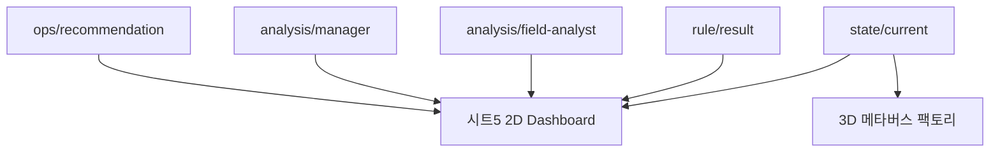

# 07. 시트5 시각화

## 이 단계에서 배우는 것

시트5는 전체 실습 흐름을 2D Dashboard로 관제합니다. 이후 3D 메타버스 팩토리와 비교하며 어떤 시각화가 어떤 상황에 적합한지 이해합니다.

## 전체 흐름에서의 위치

## 2D Dashboard가 보여줄 것

- 현재 온도
- 현재 진동
- 컨베이어벨트 power
- 컨베이어벨트 overheatMode
- 에어컨 power
- 룰엔진 판단
- 현장 분석가 메시지
- 관리자 메시지
- 운영 권고

온도 게이지는 강의 실습 기준으로 `20도~50도` 범위를 기본 표시 범위로 둡니다.

## 2D Dashboard의 장점

- 수치와 상태를 빠르게 확인할 수 있습니다.
- 룰엔진 결과와 AI 메시지를 한 화면에 배치하기 쉽습니다.
- Node-RED 흐름과 같은 도구 안에서 빠르게 구성할 수 있습니다.
- 실습 중 디버깅에 유리합니다.

## 3D 메타버스 팩토리의 장점

- 공간 구조를 직관적으로 이해할 수 있습니다.
- 비숙련자도 설비 위치와 상황을 빠르게 파악할 수 있습니다.
- 현장 교육, 관제 데모, 이해관계자 설명에 효과적입니다.

## 3D 시각화의 한계

- 제작 비용과 유지보수 비용이 큽니다.
- 모든 데이터를 3D로 표현하면 오히려 복잡해질 수 있습니다.
- 실시간 운영 판단에는 2D Dashboard가 더 빠를 수 있습니다.

## 따라하기

1. 시트5 JSON을 import합니다.
2. 시트1과 시트2가 먼저 동작 중인지 확인합니다.
3. MQTTX에서 `state/current`와 `rule/result`를 확인합니다.
4. Dashboard 화면에서 온도, 진동, 설비 상태가 갱신되는지 봅니다.
5. 시트3과 시트4를 연결한 뒤 AI 메시지 영역도 확인합니다.
6. 선택적으로 3D 메타버스 팩토리를 실행하고 `state/current` 기반 연동을 확인합니다.

## 성공 기준

- 시트1과 시트2만으로도 기본 상태 관제가 됩니다.
- 시트3과 시트4를 켜면 AI 메시지까지 Dashboard에 표시됩니다.
- 2D와 3D의 목적 차이를 설명할 수 있습니다.

## 자주 막히는 지점

- Dashboard가 비어 있으면 먼저 MQTT 토픽이 들어오는지 확인합니다.
- Dashboard 설치 패키지 버전이 다르면 import 오류가 날 수 있습니다.
- 3D 화면은 우선 `state/current` 기반 현황 표시부터 연결하는 것이 좋습니다.

## 다음 단계로 넘어가기 전 체크

- Dashboard가 전체 흐름 관제용이라는 점을 이해했습니다.
- 3D는 실습 필수라기보다 직관적 이해를 돕는 확장이라는 점을 이해했습니다.
- 시트4 관리자 AI 메시지가 Dashboard에 들어올 준비가 됐습니다.
