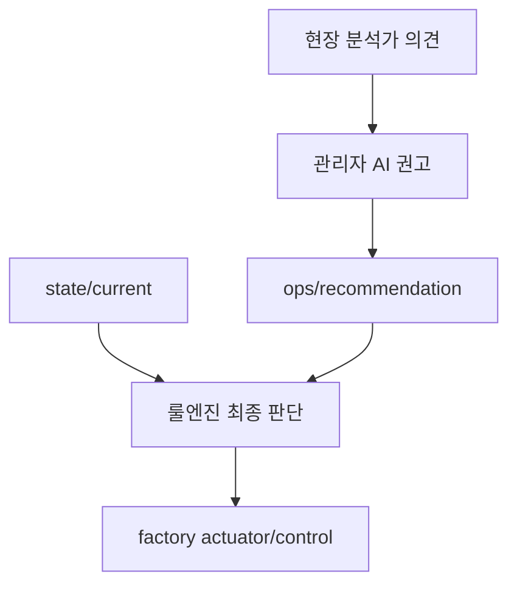

# 09. 운영 권고 반영

## 이 단계에서 배우는 것

시트4 관리자 AI가 발행한 운영 권고를 시트2 룰엔진이 어떻게 안전하게 반영하는지 확인합니다.

핵심은 AI 권고를 그대로 실행하지 않는 것입니다. 룰엔진은 최종 안전 기준을 확인한 뒤 제어를 수행합니다.

## 전체 흐름에서의 위치



## 입력 토픽

룰엔진은 두 입력을 함께 봅니다.

```text
kiot/{uniq-user-id}/dt/factory/room-01/state/current
kiot/{uniq-user-id}/dt/factory/room-01/ops/recommendation
```

## 권고 코드

| operationCode | 의미 | 룰엔진 반영 예시 |
| --- | --- | --- |
| `recommend-to-cool-now` | 조기 냉각 권고 | 온도 상승 중이고 에어컨 off면 aircon on |
| `recommend-to-stop` | 장비 보호 목적 선제 셧다운 권고 | 고온 근접 또는 과열 상태면 conveyor off |

정상 상태에서는 권고를 보내지 않는 것이 기본입니다.

## 룰엔진 반영 원칙

- 운영 권고는 참고 정보입니다.
- `state/current`가 stale이면 제어하지 않습니다.
- 현재 상태와 권고가 맞지 않으면 제어하지 않습니다.
- 제어는 항상 `factory/.../control`로 발행합니다.
- 룰엔진 판단 결과는 `rule/result`로 남깁니다.

## 시나리오 1. 조기 냉각

조건:

- 온도가 25도에서 빠르게 상승 중
- 컨베이어벨트 on
- 과열 모드 on
- 에어컨 off
- 관리자 AI가 `recommend-to-cool-now` 발행

기대 동작:

- 룰엔진이 상태를 확인합니다.
- 조기 냉각이 합리적이면 에어컨 on control을 발행합니다.
- `rule/result`에 권고 반영 이유를 남깁니다.

## 시나리오 2. 선제 셧다운

조건:

- 온도가 40도 부근까지 상승
- 과열 모드 on
- 컨베이어벨트 on
- 관리자 AI가 `recommend-to-stop` 발행

기대 동작:

- 룰엔진이 장비 보호 목적의 선제 셧다운이 타당한지 확인합니다.
- 타당하면 컨베이어벨트 off control을 발행합니다.
- 에어컨은 냉각 목적상 on 상태를 유지할 수 있습니다.

## 시나리오 3. 권고 무시

조건:

- 온도 25도
- 컨베이어벨트 off
- 과열 모드 off
- 에어컨 off
- 잘못된 `recommend-to-cool-now` 수신

기대 동작:

- 룰엔진은 불필요한 제어를 하지 않습니다.
- `rule/result`에는 정상 상태 또는 권고 미반영 이유를 남길 수 있습니다.

## 성공 기준

- AI 권고가 직접 제어로 이어지지 않습니다.
- 룰엔진이 현재 상태를 보고 권고를 반영하거나 보류합니다.
- 권고가 반영되면 실제 control 토픽은 `factory` 영역으로 발행됩니다.

## 자주 막히는 지점

- `ops/recommendation`이 너무 자주 발행되면 루프처럼 보일 수 있습니다.
- 정상 상태에서 monitor 권고를 계속 발행하는 구조는 피하는 편이 좋습니다.
- 권고 payload에 `operationCode`가 없으면 룰엔진이 처리하기 어렵습니다.

## 다음 단계로 넘어가기 전 체크

- 운영 권고와 최종 제어의 차이를 설명할 수 있습니다.
- AI가 틀릴 수 있다는 전제에서 룰엔진이 필요한 이유를 이해했습니다.
- 안전 제어는 명시적이고 검증 가능한 코드로 수행해야 한다는 점을 이해했습니다.
