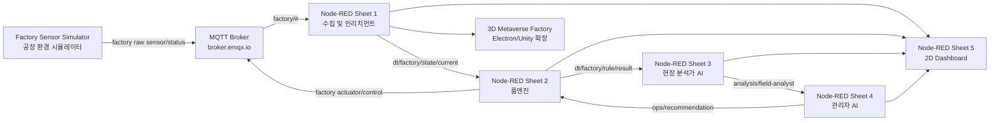

# 디지털 트윈 팩토리 실습 핸드북

## 이 핸드북에서 만드는 것

이 핸드북은 대학생 멘토링 과정에서 `AIoT 디지털 트윈 팩토리`를 단계적으로 이해하고 구현하기 위한 공개용 학습 문서입니다.

최종적으로는 작은 공장 환경을 시뮬레이터로 만들고, MQTT로 센서와 액추에이터 메시지를 주고받으며, Node-RED에서 디지털 트윈 데이터 처리, 룰엔진, AI 에이전트 협업, 대시보드 시각화까지 연결합니다.

핵심 목표는 도구 사용법을 각각 외우는 것이 아닙니다. `현장 데이터가 어떻게 디지털 트윈 서버로 들어오고, 어떤 기준으로 판단되며, AI가 어디에서 도움을 주고, 최종 제어는 누가 수행하는지`를 하나의 흐름으로 이해하는 것입니다.

## 전체 흐름



## 구성요소 역할

| 구성요소 | 역할 | 핵심 산출물 |
| --- | --- | --- |
| 공장 시뮬레이터 | 실제 센서와 설비를 대신해 온도, 진동, 컨베이어벨트, 에어컨 상태를 발행 | `kiot/{user}/factory/...` |
| MQTT 브로커 | 각 모듈을 느슨하게 연결하는 메시지 허브 | `broker.emqx.io:1883` |
| Node-RED 시트 1 | raw 데이터를 디지털 트윈 데이터로 인리치먼트하고 최신 상태를 집계 | `dt/factory/...`, `state/current` |
| Node-RED 시트 2 | 주입된 룰 기반으로 상태를 판단하고 최종 제어 수행 | `rule/result`, actuator control |
| Node-RED 시트 3 | 현장 분석가 페르소나로 위험 징후를 조기 해석 | `analysis/field-analyst` |
| Node-RED 시트 4 | 관리자 페르소나로 운영 권고 생성 | `analysis/manager`, `ops/recommendation` |
| Node-RED 시트 5 | 전체 흐름을 2D 대시보드로 관제 | 온도, 진동, 룰결과, AI 메시지 |
| 3D 시각화 | 공장 공간을 직관적으로 이해하도록 확장 | 메타버스 팩토리 화면 |

## 토픽 네임스페이스

모든 MQTT 메시지는 `kiot/{uniq-user-id}` 아래에서 관리합니다.

| 구분 | 토픽 패턴 | 의미 |
| --- | --- | --- |
| 실세계 팩토리 | `kiot/{uniq-user-id}/factory/...` | 시뮬레이터가 발행하거나 제어를 수신하는 영역 |
| 디지털 트윈 | `kiot/{uniq-user-id}/dt/factory/...` | Node-RED가 해석, 집계, 판단한 영역 |

이 구조를 사용하면 강사는 `kiot/#`으로 전체 흐름을 볼 수 있고, 학생은 자신의 `{uniq-user-id}` 하위만 관리하면 됩니다.

## 공장 시뮬레이터 토픽

시뮬레이터는 Node.js 서버로 별도 구성하는 것을 기준으로 합니다. 이렇게 분리하면 나중에 실제 Raspberry Pi 또는 실제 센서 장비로 바꿔도 개념이 크게 흔들리지 않습니다.

### 발행 토픽

| 토픽 | payload 예시 |
| --- | --- |
| `kiot/{uniq-user-id}/factory/room-01/sensor/temperature` | `{ "value": 25 }` |
| `kiot/{uniq-user-id}/factory/room-01/sensor/vibration` | `{ "value": 0 }` |
| `kiot/{uniq-user-id}/factory/room-01/actuator/conveyor-belt/status` | `{ "power": "on", "overheatMode": "off" }` |
| `kiot/{uniq-user-id}/factory/room-01/actuator/aircon/status` | `{ "power": "off" }` |

### 구독 토픽

| 토픽 | payload 예시 |
| --- | --- |
| `kiot/{uniq-user-id}/factory/room-01/actuator/conveyor-belt/control` | `{ "power": "on", "overheatMode": "on", "reason": "manual-test" }` |
| `kiot/{uniq-user-id}/factory/room-01/actuator/aircon/control` | `{ "power": "on", "reason": "rule-warning" }` |

### 온도 모델 기준

| 조건 | 변화 |
| --- | --- |
| 두 장비 모두 꺼짐 | 평상 온도 25도로 0.1도씩 복귀 |
| 에어컨만 켜짐 | 최저 22도까지 냉각 |
| 컨베이어벨트만 켜짐 | 최대 50도까지 가열 |
| 컨베이어벨트 가동 | 기본 +0.2도 |
| 에어컨 가동 | 기본 -0.3도 |
| 둘 다 켜짐 | 에어컨 성능 우세로 -0.1도씩 하강 |
| 과열 모드 켜짐 | 컨베이어벨트 가동 중 추가 +1.0도 |

`overheatMode`는 상태값입니다. 컨베이어벨트가 꺼져 있으면 과열 모드가 켜져 있어도 온도 상승에 관여하지 않습니다.

## Node-RED 시트 구성

### 시트 1. 센서 데이터 수집 및 인리치먼트

시트 1은 공장 시뮬레이터의 raw 토픽을 구독하고, 디지털 트윈 영역의 데이터로 변환합니다.

주요 역할:

- `factory` 토픽 구독
- payload를 JSON object로 정규화
- `userId`, `roomId`, `sourceType`, `originalTopic`, `updatedAt` 보강
- `dt/factory` per-topic 토픽 발행
- 최신 4개 상태를 모아 `state/current` 스냅샷 발행

집계 스냅샷 토픽:

```text
kiot/{uniq-user-id}/dt/factory/room-01/state/current
```

`state/current` 예시:

```json
{
  "userId": "student-01",
  "roomId": "room-01",
  "observedAt": "2026-04-19T00:00:00.000Z",
  "snapshotMode": "fixed-interval-latest",
  "completeness": "ready",
  "sensors": {
    "temperature": { "value": 25, "updatedAt": "2026-04-19T00:00:00.000Z" },
    "vibration": { "value": 0, "updatedAt": "2026-04-19T00:00:00.000Z" }
  },
  "actuators": {
    "conveyorBelt": { "power": "off", "overheatMode": "off", "updatedAt": "2026-04-19T00:00:00.000Z" },
    "aircon": { "power": "off", "updatedAt": "2026-04-19T00:00:00.000Z" }
  }
}
```

시뮬레이터가 꺼져 새 데이터가 들어오지 않으면 오래된 값으로 계속 스냅샷을 발행하지 않는 것이 바람직합니다. 불필요한 루프는 룰엔진과 AI 에이전트 호출을 낭비하게 만듭니다.

### 시트 2. 룰엔진

시트 2는 `state/current`를 읽어 주입된 규칙으로 판단합니다. 룰엔진은 최종 제어권을 갖습니다.

입력:

- `kiot/{uniq-user-id}/dt/factory/room-01/state/current`
- `kiot/{uniq-user-id}/dt/factory/room-01/ops/recommendation`

출력:

- `kiot/{uniq-user-id}/dt/factory/room-01/rule/result`
- `kiot/{uniq-user-id}/factory/room-01/actuator/aircon/control`
- `kiot/{uniq-user-id}/factory/room-01/actuator/conveyor-belt/control`

기본 판단 기준:

| 조건 | 룰엔진 판단 | 제어 |
| --- | --- | --- |
| 35도 미만 | normal | 관찰 |
| 35도 이상 | warning | 에어컨 on |
| 45도 이상 | critical | 조건 지속 시 컨베이어벨트 off |
| 데이터 오래됨 | stale-state | 제어 보류 |

AI가 운영 권고를 보내더라도 룰엔진이 최종 판단합니다. 이 구조는 LLM 답변이 불안정하더라도 실제 설비 제어는 검증된 규칙을 통해 수행하게 만드는 안전장치입니다.

### 시트 3. 현장 분석가 AI 에이전트

시트 3은 `state/current`와 `rule/result`를 함께 읽고, 현장 위험 조기 해석 담당자 페르소나로 상황을 설명합니다.

입력:

- `kiot/{uniq-user-id}/dt/factory/room-01/state/current`
- `kiot/{uniq-user-id}/dt/factory/room-01/rule/result`

출력:

```text
kiot/{uniq-user-id}/dt/factory/room-01/analysis/field-analyst
```

역할:

- 현재 현장 상태 요약
- 과열 모드와 급격한 온도 상승 징후 해석
- 35도 이전에도 선제 냉각 필요성을 설명
- 40도 부근에서 장비 보호 관점의 사전 셧다운 필요성을 설명

실습에서는 mock 에이전트로 먼저 동작을 확인하고, 이후 Gemini API, ChatGPT API, Claude API, 로컬 Ollama 같은 LLM으로 교체할 수 있습니다.

### 시트 4. 관리자 AI 에이전트

시트 4는 현장 분석가 메시지를 받아 운영 관점의 권고를 생성합니다.

입력:

```text
kiot/{uniq-user-id}/dt/factory/room-01/analysis/field-analyst
```

출력:

- `kiot/{uniq-user-id}/dt/factory/room-01/analysis/manager`
- `kiot/{uniq-user-id}/dt/factory/room-01/ops/recommendation`

운영 권고 예시:

```json
{
  "operationCode": "recommend-to-cool-now",
  "message": "온도 상승 속도가 빠르므로 에어컨 조기 가동을 권고합니다.",
  "reason": "early-cooling-recommended"
}
```

```json
{
  "operationCode": "recommend-to-stop",
  "message": "장비 보호 목적상 선제 셧다운 권고가 필요합니다.",
  "reason": "preemptive-stop-near-critical-zone"
}
```

관리자 에이전트는 직접 설비를 제어하지 않습니다. 운영 권고를 발행하고, 룰엔진이 이를 참고해 최종 제어를 결정합니다.

### 시트 5. 2D Dashboard

시트 5는 전체 흐름을 관제합니다.

표시 항목:

- 현재 온도
- 현재 진동
- 컨베이어벨트 power
- 컨베이어벨트 overheatMode
- 에어컨 power
- 룰엔진 상태
- 현장 분석가 메시지
- 관리자 메시지
- 운영 권고

온도 게이지는 강의 실습 기준으로 `20도~50도` 범위를 기본 표시 범위로 둡니다.

## 대표 실습 시나리오

### 1. 정상 상태 확인

컨베이어벨트와 에어컨이 모두 꺼져 있고 온도는 25도 주변을 유지합니다.

확인할 것:

- `factory` raw 토픽이 정상 발행되는가
- 시트 1이 `dt/factory` 토픽과 `state/current`를 만드는가
- 룰엔진이 normal 상태를 발행하는가
- 대시보드에 정상 상태가 표시되는가

### 2. 수동 제어 테스트

MQTTX 또는 제어 패널로 컨베이어벨트와 에어컨을 직접 켜고 끕니다.

확인할 것:

- control 토픽 발행 후 status가 즉시 바뀌는가
- 시트 1이 변경된 status를 `state/current`에 반영하는가
- 대시보드에 변경 상태가 표시되는가

### 3. 과열 모드 테스트

컨베이어벨트를 켜고 `overheatMode`를 on으로 바꿉니다.

확인할 것:

- 온도가 빠르게 상승하는가
- 35도 이상에서 룰엔진이 에어컨 on을 발행하는가
- 냉각이 켜져도 과열 모드 때문에 온도가 계속 오를 수 있는가

### 4. AI 조기 경고 테스트

온도가 35도에 도달하기 전이라도 상승 속도와 과열 모드를 바탕으로 현장 분석가가 위험을 설명합니다.

확인할 것:

- 시트 3이 `analysis/field-analyst`를 발행하는가
- 메시지가 단순 수치 반복이 아니라 현장 해석 형태인가

### 5. 관리자 권고와 룰엔진 최종 판단

관리자 에이전트가 조기 냉각 또는 선제 셧다운 권고를 발행합니다.

확인할 것:

- 시트 4가 `ops/recommendation`을 발행하는가
- 룰엔진이 권고를 참고하되 최종 제어권을 유지하는가
- 제어 토픽은 `dt`가 아닌 실제 `factory` 영역으로 발행되는가

## MQTTX 점검 팁

학생 본인 흐름 전체 확인:

```text
kiot/{uniq-user-id}/#
```

시뮬레이터 raw 데이터만 확인:

```text
kiot/{uniq-user-id}/factory/#
```

디지털 트윈 해석 데이터만 확인:

```text
kiot/{uniq-user-id}/dt/factory/#
```

강사가 전체 학생 흐름 확인:

```text
kiot/#
```

메시지가 너무 많으면 특정 단계 토픽만 좁혀서 구독합니다.

## 자주 막히는 지점

| 증상 | 먼저 확인할 것 |
| --- | --- |
| MQTTX에 메시지가 안 보임 | 브로커가 `broker.emqx.io:1883`인지, 사용자 ID가 맞는지 확인 |
| Node-RED가 메시지를 못 받음 | import 후 `배포하기`를 눌렀는지 확인 |
| 다른 학생 메시지가 섞임 | `zenit`을 자신의 `uniq-user-id`로 바꿨는지 확인 |
| 에어컨이 안 켜짐 | 룰엔진 제어 토픽이 `factory/.../aircon/control`인지 확인 |
| 컨베이어벨트가 안 켜짐 | 시뮬레이터가 control 토픽을 구독 중인지 확인 |
| AI API가 실패함 | API Key를 Node-RED JSON에 직접 넣지 말고 로컬 설정 또는 환경변수로 주입 |
| 시뮬레이터를 껐는데 메시지가 계속 나옴 | 시트 1이 오래된 상태를 반복 발행하지 않도록 집계 로직 확인 |

## 학습 후 설명할 수 있어야 하는 것

- 왜 실세계 토픽과 디지털 트윈 토픽을 분리하는가
- 인리치먼트가 단순 값 복사가 아니라 판단 가능한 상태로 바꾸는 과정인 이유
- 룰엔진이 최종 제어권을 가져야 하는 이유
- AI 에이전트가 직접 제어하지 않고 운영 권고만 발행하는 이유
- 2D Dashboard와 3D 메타버스 팩토리가 각각 어떤 장단점을 갖는지

## 다음 확장 아이디어

- 실제 Raspberry Pi 센서로 시뮬레이터 대체
- 로컬 Ollama 기반 LLM 호출
- Gemini, ChatGPT, Claude 응답 비교
- 진동 기반 이상 감지 시나리오
- 소리 센서를 추가한 위급 상황 감지
- 3D 메타버스 팩토리에서 룰엔진과 AI 메시지 팝업 표시
