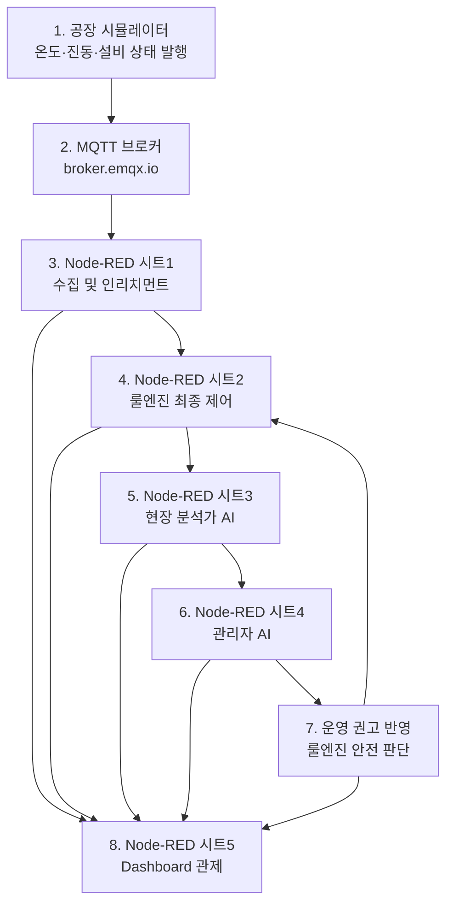

# 디지털 트윈 팩토리 실습 핸드북

이 핸드북은 대학생 멘토링에서 `AIoT 디지털 트윈 팩토리`를 단계적으로 구현하기 위한 학습 문서입니다.

최종 목표는 공장 시뮬레이터, MQTT, Node-RED, 룰엔진, AI 에이전트, Dashboard 관제를 하나의 흐름으로 연결하는 것입니다. 각 도구를 따로 배우는 것이 아니라, 현장 데이터가 디지털 트윈 서버로 들어와 판단되고 운영 권고와 제어로 이어지는 과정을 이해하는 데 초점을 둡니다.

## 최종 완성 구조

Mermaid 다이어그램은 화면 폭 문제를 줄이기 위해 기본적으로 세로형 `TB` 구조를 사용합니다. 다이어그램이 작게 보이면 클릭해서 확대 화면으로 볼 수 있습니다.

## 학습 순서

| 순서 | 문서 | 핵심 결과 |
| --- | --- | --- |
| 0 | [학습 로드맵](./00-learning-map) | 전체 실습 순서 이해 |
| 1 | [공장 시뮬레이터](./01-factory-simulator) | raw MQTT 토픽 발행 확인 |
| 2 | [MQTT와 Node-RED HelloWorld](./02-mqtt-and-node-red-hello-world) | Node-RED 첫 메시지 발행/구독 |
| 3 | [시트1 인리치먼트](./03-sheet1-enrichment) | `dt/factory`, `state/current` 생성 |
| 4 | [시트2 룰엔진](./04-sheet2-rule-engine) | 에어컨 제어와 셧다운 기준 확인 |
| 5 | [시트3 현장 분석가 AI](./05-sheet3-field-analyst-agent) | mock 또는 LLM 기반 현장 의견 생성 |
| 6 | [시트4 관리자 AI](./06-sheet4-manager-agent) | 운영 권고 메시지 생성 |
| 7 | [운영 권고 반영](./07-rule-engine-with-ops-recommendation) | 룰엔진이 권고를 안전하게 반영 |
| 8 | [시트5 Dashboard](./08-sheet5-dashboard) | 전체 상태와 판단 흐름 관제 |

## 먼저 기억할 원칙

- 실세계 토픽은 `kiot/{uniq-user-id}/factory/...`입니다.
- 디지털 트윈 토픽은 `kiot/{uniq-user-id}/dt/factory/...`입니다.
- 시뮬레이터는 센서와 설비 상태를 발행하고, 위험 판단은 하지 않습니다.
- Node-RED 시트1은 데이터를 판단 가능한 상태로 정리합니다.
- 룰엔진은 최종 제어권을 갖습니다.
- AI 에이전트는 직접 제어하지 않고 해석과 운영 권고를 담당합니다.
- API Key는 공개 문서, Node-RED JSON, Git 저장소에 직접 넣지 않습니다.

## 참고 문서

- [토픽과 Payload 레퍼런스](./90-topic-and-payload-reference)
- [문제 해결 체크리스트](./91-troubleshooting)
